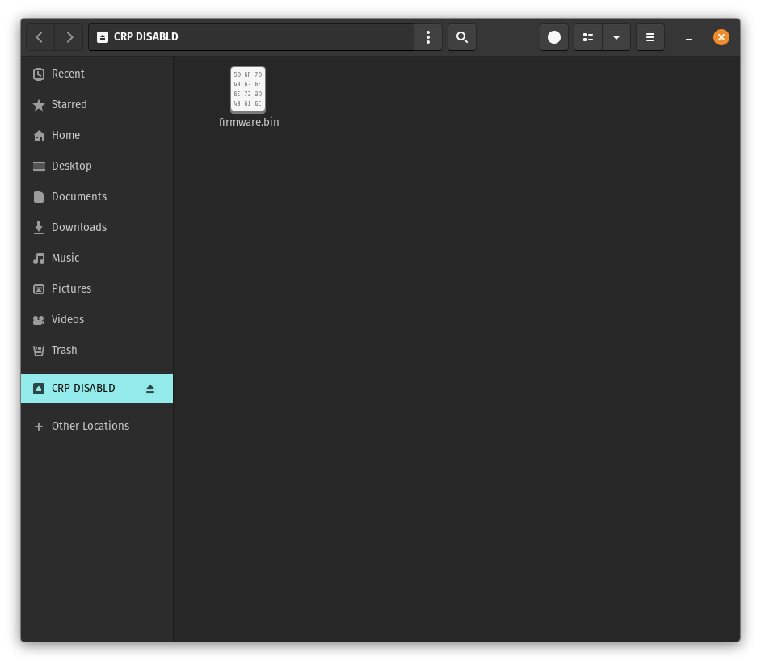

# Epower V Firmware

Unofficial Firmware for the [EVGA EPOWER V](https://www.evga.com/products/pdf/100-UV-0600.pdf) power board.

## **This firmware is provided as is, without any kind of liability or warranty, either from me or EVGA. Use at your own risk only! I have no affiliation with EVGA.**

## How to flash

This firmware can be flashed using the USB-C port. It does not use the DFU bootloader used to flash the official Epower firmware since it frequently fails to work correctly.

To flash the firmware the Epower must first be in the right mode. There is a 4-pin header labeled J10 at the top right of the board. Connect the outer 2 pins together temporarily and power on the Epower with the USB-C conncted to a PC.

If the connections is working the LEDs will change color and the 7-segment display will not display anything. On the PC there should appear a storage device named "CRP Disabled" with a single file called "firmware.bin". 

This file contains the firmware currently on the Epower and should be backed up, so that you can always go back to it using the same flashing method. Note that even when doing that there is still the risk of issues arising later on as the eeprom content will have been altered.

After backing up the original file, replace it with the firmware binary provided [here](https://github.com/juvgrfunex/epower_v/releases), then power off the Epower and disconnect the temporary connection on J10. The flashing process is now complete.

## How to use

With the firmware flashed it is now possible to control the Epower V over I2C via the EVBot connector as originally intended. The pinout for the connector looks like this:

| __SDA__ | __SCL__ | __Unused__ |
| :-: | :-: | :-: | 
| __GND__ | __Unused__ | __Empty__ | 

While any software that can interface with the IR3595 voltage controller can be used the recommented method is using an [Elmorlabs EVC2](https://elmorlabs.com/product/elmorlabs-evc2se/), the required profile is provided [here](EPOWER_V.xml). Simply copy it into the I2C_DEVICES folder in the EVC2 software.

After scanning the EVC2 software should find two devices. The IR3595 on address 0x08 and the Epower V itself on address 0x0E.
The IR3595 control works the same as with any other IR3595 VRM and would not even need the extra profile.

The Epower V device provides monitoring for the five main voltages on the Epower and some configuration.

The bootup voltages for both outputs can be configered to any VID value or turned off completely.  

Each 7-segment row can be configured to show one of voltage, current or temperature for either of the two outputs.
The display can also be flipped in orientation for when the Epower had to be mounted upside down. 

## Why use this firmware

- Enables software voltage control via I2C

- Custom bootup voltages can be set

- 7-segment display can be configured to show different metrics

## Why *not* use this firmware

- As this is an unofficial firmware relying on reverse engineering it might have unexpected bugs that could in the worst case result in damage to your hardware.

- Physical controls, i.e. the buttons and switches, are not yet implementet and do nothing right now.

If you decide not to use the firmware check out the [uart interface](https://xdevs.com/doc/_PC_HW/EVGA/DA0066/epower_software_V.pdf) as an alternative that works with the official firmware.

## Planned features

- Implement physical controls

- Implement control over USB-C

- (possibly) group multiple Epower V together so that they can be controlled as one

## License

Licensed under [MIT license](LICENSE)
